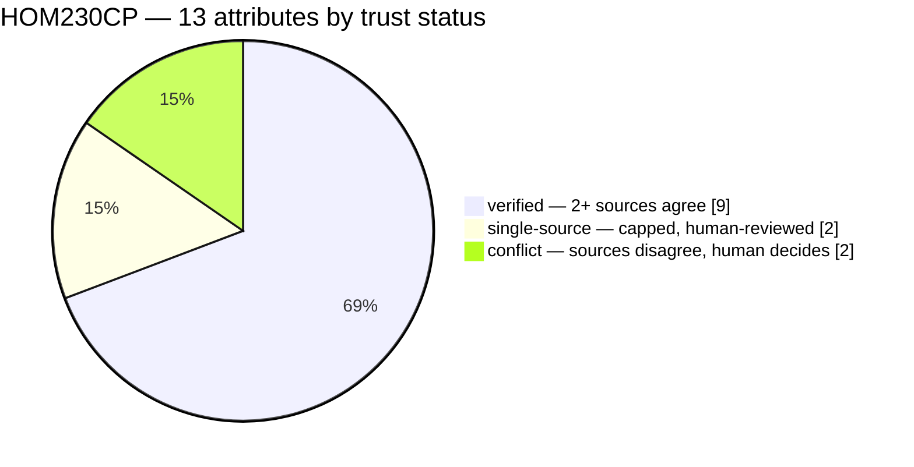
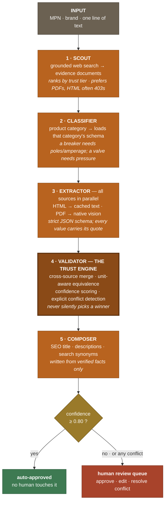
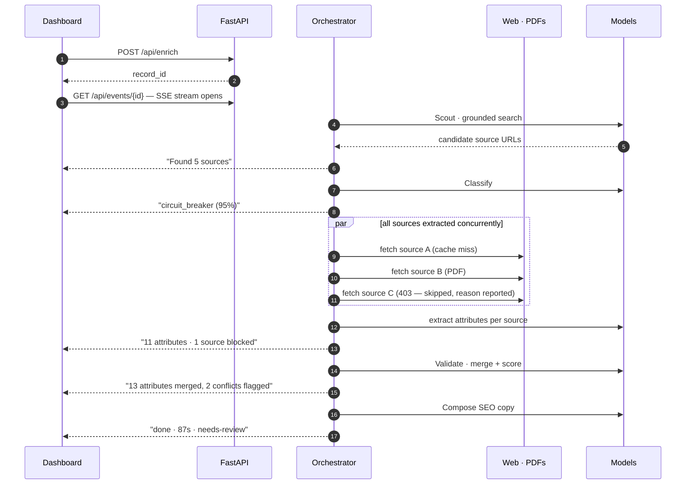
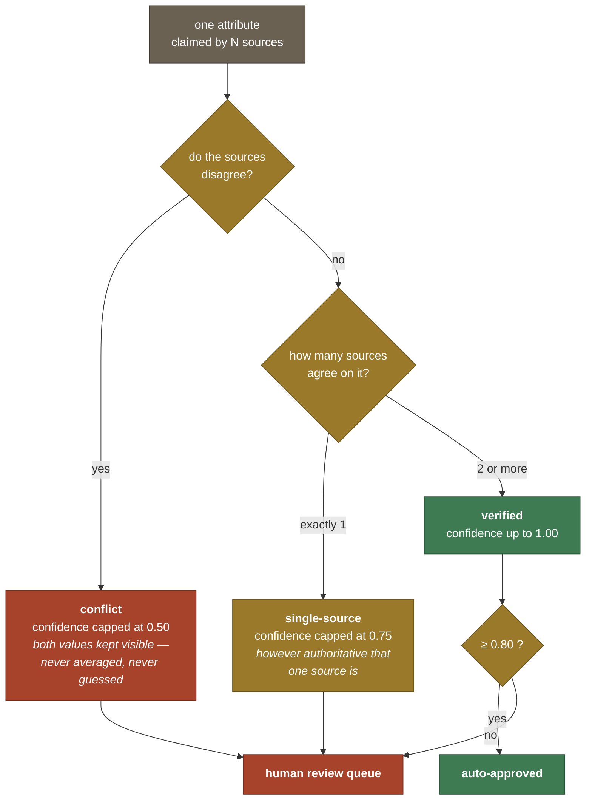
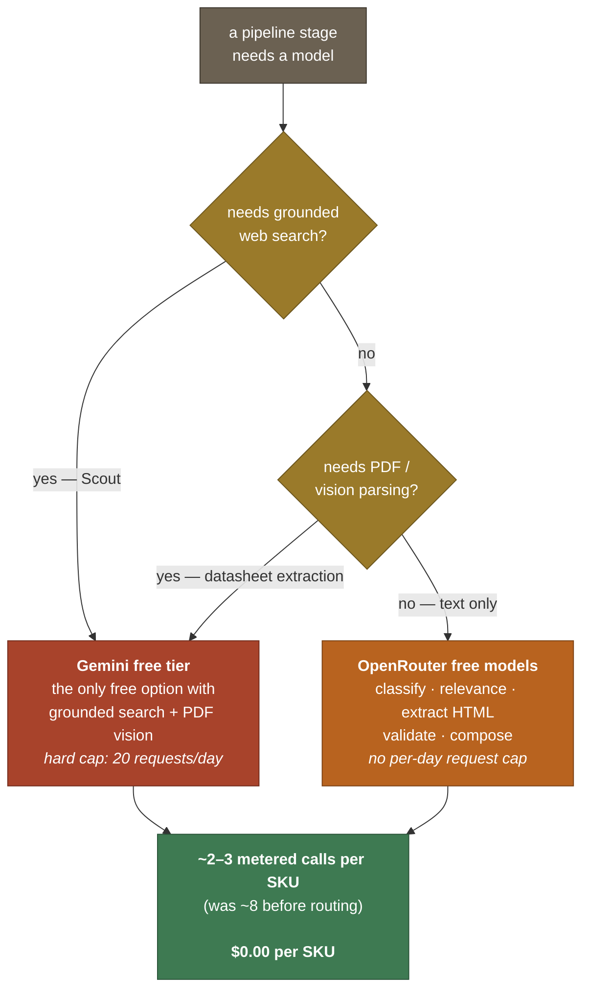

# SKUForge

**Turn a manufacturer part number, a brand, and one line of description into a complete, commerce-ready product record — where every single attribute carries a confidence score, a cited source, and a visible flag when two sources disagree.**

Built solo for **UniHack 2026**, the Unilog AI Hackathon.


```
INPUT   HOM230CP · Square D · "30A 2 pole breaker"
                              ↓
OUTPUT  13 technical attributes · category · SEO title · short + long description
        · search synonyms · certifications · datasheet links
        — each attribute scored, sourced, and quote-backed
        — 2 genuine cross-source conflicts surfaced for human review
        — 87 seconds
```

---

## Table of contents

- [The challenge](#the-challenge)
- [Why naive AI enrichment fails here](#why-naive-ai-enrichment-fails-here)
- [How SKUForge answers the brief](#how-skuforge-answers-the-brief)
- [Verified live results](#verified-live-results)
- [Architecture](#architecture)
- [The Trust Engine — our core contribution](#the-trust-engine--our-core-contribution)
- [Category-aware extraction schema](#category-aware-extraction-schema)
- [Capability-routed model layer (and why it costs ₹0)](#capability-routed-model-layer-and-why-it-costs-0)
- [Human-in-the-loop](#human-in-the-loop)
- [Scaling to a real catalog](#scaling-to-a-real-catalog)
- [Engineering quality](#engineering-quality)
- [Run it yourself](#run-it-yourself)
- [Project structure](#project-structure)
- [Honest limitations](#honest-limitations)
- [Roadmap](#roadmap)

---

## The challenge

> *"Turn minimal product information — a manufacturer part number, a brand, and a single line of description — into rich, structured, commerce-ready product intelligence."*

B2B distributors receive supplier feeds containing almost nothing: a part number, a brand name, and maybe a sentence. Turning that into a sellable catalog listing — granular technical specifications, taxonomy placement, SEO copy, certifications, digital assets — is done today largely by **human content teams**. It is slow, expensive, and it does not scale to catalogs with hundreds of thousands of SKUs.

This is not a hypothetical problem. It is the daily reality of the industry the hackathon is set in, and it is precisely the bottleneck that separates a distributor's catalog from being findable and sellable online.

## Why naive AI enrichment fails here

The obvious solution — hand the part number to an LLM and ask it to fill in the specifications — is **actively dangerous** in this domain, and the problem statement says so explicitly:

> *"Hallucinations in industrial data can lead to dangerous or expensive order errors."*

An invented voltage rating on a circuit breaker is not a typo. It is a wrong part on a job site, a returned order, a failed inspection, or a safety incident. Any system that generates industrial product data without proving where each value came from is unusable in production, no matter how fluent its output.

**So SKUForge is built around a single organising principle: every generated fact must be able to answer three questions — what is it, where did it come from, and how certain are we?**

## How SKUForge answers the brief

### Expected outcomes → implementation

| Required outcome | How SKUForge delivers it |
|---|---|
| **Generate structured product intelligence from limited inputs** | Five-agent pipeline turns `MPN + brand + one line` into a full record: 6–13 normalised attribute/value pairs, category placement, SEO title, short + long description, search synonyms, certifications, datasheet links, and equivalent-MPN hints. No other input required. |
| **Improve product data quality and consistency** | Category-aware schemas (12 templates) force consistent attribute naming per product type. Unit-aware normalisation, subsumption merging, and case-insensitive de-duplication collapse the same fact expressed differently across sources into one canonical value. |
| **Validate and enrich information with traceable outputs** | Every attribute carries a `confidence` score (0–1), a `status` (`verified` / `single-source` / `conflict` / `generated`), and an `evidence` list of `{source_url, source_type, raw_value, quote}` — the **exact sentence** from the source document that supports the value. Conflicts are never silently resolved. |
| **Scale efficiently across large product catalogs** | Resumable CSV batch runner with bounded concurrency; per-source extraction runs in parallel; a disk evidence cache means no page or PDF is ever fetched twice across a catalog run; auto-approval routes only low-confidence attributes to humans. |

### Judging criteria → evidence

| Criterion | Where to look |
|---|---|
| **Innovation** | The Trust Engine: per-attribute confidence, provenance quotes, and explicit cross-source conflict detection — with a hard rule that an uncorroborated value can *never* auto-approve. Plus capability-routed multi-provider inference that runs the entire system at zero cost. |
| **Technical implementation** | Hand-rolled async agent orchestration (no framework black box), strict schema-constrained model output, native PDF/vision datasheet parsing, SSE event streaming, deterministic parallel merging, 12 automated tests including replay-fidelity pinning. |
| **Business relevance** | Directly targets the human content-team bottleneck. Cost and time modelled against real manual enrichment economics; output shape matches a real commerce-ready record (specs, taxonomy, SEO, certifications, syndication-ready CSV export). |
| **Scalability** | Batch runner, evidence caching, parallel extraction, provider-level concurrency governors, quota-aware failure handling that stops a catalog run cleanly rather than burning through it. |
| **Overall impact** | ₹150–250 and hours of human effort per SKU → **~90 seconds and ₹0**, with a stronger audit trail than the manual process it replaces. |

### Suggested approaches, and which we used

The brief invited AI agents, RAG, knowledge graphs, document intelligence, vision-language models, and human-in-the-loop workflows. We used four of these deliberately, and explain below why we skipped the others rather than adding them for show:

| Approach | Used | How / why not |
|---|---|---|
| **AI agents (multi-agent)** | ✅ | Five specialised agents — Scout, Classifier, Extractor, Validator, Composer — each with one job and its own model routing. |
| **Retrieval / grounding** | ✅ | Live grounded web search discovers real evidence documents at enrichment time; retrieved documents are cached and re-read as the extraction corpus. |
| **Document intelligence + VLM** | ✅ | Manufacturer HTML pages are frequently bot-blocked, but their spec-sheet PDFs are not. PDFs are passed natively to a vision-capable model to read specification tables. |
| **Human-in-the-loop** | ✅ | Confidence-thresholded review queue with approve / edit / reject and one-click conflict resolution. |
| **Knowledge graph** | ⚠️ Partial | Equivalent/replacement MPNs are captured when sources state them, but we did not build a full parts graph — it is on the roadmap rather than half-built for the demo. |

---

## Verified live results

Every number below came from an **actual live run against the real public internet** — not a simulation, and not an estimate.

| SKU | Category | Sources found / usable | Attributes | Conflicts surfaced | Time | Cost |
|---|---|---|---|---|---|---|
| **Square D HOM230CP** (breaker) | `circuit_breaker` | 5 / 3 | 13 | 2 | 87 s | $0.0272 |
| **Leviton 1451-2W** (switch) | `switch` | 5 / 2 | 10 | 1 | 115 s | **$0.00** |
| **Square D QO120** (breaker) | `circuit_breaker` | 5 / 1 | 6 | 0 | 148 s | **$0.00** |

### Where those 13 attributes landed

Real trust breakdown from the Square D HOM230CP run — not an illustration:



Nine attributes were corroborated well enough to stand on their own. Four were not — and the system says so rather than shipping them silently.

**What the conflicts actually caught** — these are real disagreements between real documents, exactly the errors that would otherwise enter a catalog silently:

- **`weight_lbs`** — Home Depot's PDF says `0.65 lb`, the Unilog-hosted spec sheet says `1 lb`. Net weight versus shipping weight. Flagged, not guessed.
- **`upc_gtin`** — two sources reported genuinely different GTINs for the same MPN.
- **`switch_type`** — Leviton's own datasheet says `"Toggle Switch"`; the distributor listing says `"Single Pole Toggle AC Quiet"`.

### What this replaces

| Approach | Time per SKU | Cost per SKU | Relative cost | Audit trail |
|---|---|---|---|---|
| Human content team | hours – days | ₹150 – 250 | `████████████████████` | undocumented judgement |
| Naive LLM ("just ask it") | seconds | ₹1 – 5 | `▌` | **none — hallucination risk** |
| **SKUForge** (paid profile) | ~90 s | ~₹2 | `▌` | cited · scored · conflict-flagged |
| **SKUForge** (hybrid, free) | ~90 s | **₹0** | ` ` | cited · scored · conflict-flagged |

The naive-LLM row is the important comparison. It is as cheap and fast as SKUForge — and unusable, because nothing in its output can be checked. Cost was never the hard part of this problem; **trust** was.

**Note on source availability:** of 5 discovered sources, typically only 1–3 are usable. Manufacturer HTML product pages routinely return **HTTP 403** to automated clients; some links 404 or time out. SKUForge treats partial source coverage as the normal case, reports *why* each source failed, and adjusts confidence accordingly instead of pretending it had full coverage.

---

## Architecture



Supporting infrastructure: **disk evidence cache** (nothing fetched twice) · **SQLite record store** · **SSE stream** powering a live "agent theatre" in the UI · **fixture-replay mode** reproducing real runs offline with zero API calls.

### What one enrichment actually looks like



### Why hand-rolled orchestration, not an agent framework

A deliberate engineering decision, and one we can defend: the orchestration loop is roughly 150 readable lines. It gave us exact control over parallelism, deterministic merge ordering, per-stage model routing, partial-failure semantics, and quota handling — all of which we needed and all of which would have meant fighting a framework's abstractions. The pipeline is debuggable end-to-end, and there is no hidden control flow between the input and the output.

---

## The Trust Engine — our core contribution

This is what separates SKUForge from "ask an LLM for the specs."

### How every attribute earns its status



**Read the two red paths carefully — they are the whole point.** Every route that isn't corroborated agreement ends at a human, and no amount of source authority can shortcut it.

### Every attribute is a claim with a receipt

```jsonc
{
  "name": "amperage_rating",
  "value": "30",
  "unit": "A",
  "confidence": 1.0,
  "status": "verified",
  "evidence": [
    {
      "source_url": "https://www.leviton.com/assets/PDS/1451-2W.pdf",
      "source_type": "manufacturer",
      "raw_value": "30",
      "quote": "Current Rating 30 A"          // ← the exact sentence
    },
    { "source_url": "https://www.zoro.com/...", "source_type": "distributor", ... }
  ],
  "conflicting_values": []                      // populated when sources disagree
}
```

### How confidence is computed

Confidence is **mostly deterministic**, not a number an LLM was asked to invent:

```
confidence = 0.50 × best_source_trust      (manufacturer 1.0 · distributor 0.75
                                            · marketplace 0.5 · other 0.4)
           + 0.35 × corroboration          (min(agreeing_sources / 2, 1))
           + 0.15 × coverage               (agreeing_sources / total_usable_sources)
```

A model call is used for exactly one narrow judgement — deciding whether two differently-worded values mean the same physical fact (`0.5 in` vs `1/2"`). Everything else is arithmetic you can audit.

### Two hard ceilings that cannot be overridden

| Rule | Effect | Why it exists |
|---|---|---|
| **Conflict cap — 0.50** | Any attribute where sources disagree can never auto-approve | Disagreement is a signal for a human, never something to average away |
| **Single-source ceiling — 0.75** | A value found in exactly *one* source can never auto-approve, however authoritative that source is | *This was a real bug we caught.* A lone manufacturer source scored `0.5 + 0.175 + 0.15 = 0.825`, clearing the 0.8 threshold on source trust alone. "One website said so" being treated as verified is exactly the failure this project exists to prevent — so corroboration became mandatory rather than merely weighted, and a test now pins it. |

### Four honest statuses

| Status | Meaning |
|---|---|
| `verified` | Two or more independent sources agree |
| `single-source` | Only one source states it — capped, always human-reviewed |
| `conflict` | Sources disagree — **both values kept visible**, human decides |
| `generated` | Model-inferred with no supporting source — lowest tier, always flagged |

### Provenance points at real pages

Grounded search returns redirector URLs (e.g. `vertexaisearch.cloud.google.com/grounding-api-redirect/...`). Citing those would technically be "traceable" while being useless to a human reviewer. SKUForge follows redirects and records the **final landing URL**, so evidence links resolve to `leviton.com`, `zoro.com`, and actual manufacturer PDFs — pages a person can open and check.

---

## Category-aware extraction schema

A generic schema produces generic records. Distributors — and the PIM specialists judging this — immediately notice when a circuit breaker record has no pole count.

SKUForge classifies the product first, then loads that category's attribute template, and constrains the extractor to exactly those fields. **12 templates**, electrical-first (aligned with IDEA/UNSPSC-style attribute thinking), plus a plumbing template proving the approach is not hard-coded to one vertical, plus a generic fallback:

`circuit_breaker` · `contactor` · `switch` · `receptacle` · `luminaire` · `wire_cable` · `motor` · `transformer` · `relay` · `conduit_fitting` · `plumbing_valve` · `generic`

The effect is visible in real output: the Leviton switch record carries `color`, `wiring_type`, and `number_of_gangs` — attributes that do not exist on the breaker template, and would never have been asked for by a one-size-fits-all schema.

---

## Capability-routed model layer (and why it costs ₹0)

The pipeline needs exactly **three** model capabilities:

1. **Grounded web search with citations** (Scout)
2. **PDF / vision document parsing** (Extractor, on datasheets)
3. **Schema-constrained JSON output** (every structured stage)

`llm.py` is the *only* module in the codebase that touches a vendor SDK. That single boundary makes the whole system provider-agnostic — and enabled something more interesting than portability.

**Routing is by capability, not by vendor.** Free model tiers have hard daily caps, and not all of them can search the web or read a PDF. So the `hybrid` profile spends the metered capability only where nothing else can do the job:




| Stage | Routed to | Reason |
|---|---|---|
| Scout (web search) | Gemini free tier | Only free option with grounded search + citations |
| Extractor — **PDF** | Gemini free tier | Only free option with native PDF vision |
| Classifier, Relevance | OpenRouter free models | Text-only, high volume |
| Extractor — **HTML** | OpenRouter free models | Text-only |
| Validator, Composer | OpenRouter free models | Text-only reasoning and generation |

This cut metered calls from **~8 per SKU to ~2–3**, roughly tripling daily throughput on a free tier — and the entire system runs at **$0.00 per SKU**. Switching to a paid profile is a one-line environment change (`SKUFORGE_PROVIDER=openai`) with no agent code modified, for ~$0.02–0.03/SKU and higher quality.

Available profiles: `hybrid` (recommended, free) · `gemini` · `openrouter` · `openai`.

---

## Human-in-the-loop

Automation that cannot be corrected is not trustworthy either.

- Attributes at or above **0.8 confidence auto-approve**; everything below routes to a review queue.
- Reviewers can **approve**, **edit**, or **reject** any attribute.
- For conflicts, both competing values are displayed with their sources and supporting quotes, and a **single click** adopts the correct one.
- Human decisions are recorded (`human_reviewed: true`, confidence promoted to 1.0) so a reviewed record is visibly distinct from an auto-approved one.

The economic argument: humans stop transcribing specifications and start adjudicating the small minority of genuinely ambiguous ones.

---

## Scaling to a real catalog

- **Batch runner** — `python -m skuforge.batch <csv>` processes a CSV of bare SKUs with bounded concurrency and prints a throughput / cost / quality summary.
- **Resumable** — already-enriched SKUs are skipped, so the same command can be re-run daily against a metered quota and will continue where it stopped.
- **Evidence cache** — every fetched page and PDF is cached on disk by URL hash. Across a catalog where many SKUs share datasheets, nothing is downloaded twice.
- **Parallel extraction** — sources are fetched and extracted concurrently (measured: **134 s → 87 s per SKU**), then merged in deterministic trust order so results never depend on which source returned first.
- **Concurrency governors** — `MAX_PARALLEL_EXTRACTIONS` and `BATCH_CONCURRENCY` are set per provider, so a free tier is never rate-limited by our own impatience.
- **Quota-aware** — a per-minute rate limit retries with exponential backoff honouring the provider's own retry hint; a *daily* quota exhaustion raises immediately and the batch abandons the run cleanly rather than failing every remaining SKU identically.

---

## Engineering quality

**12 automated tests**, all passing, covering the parts that actually matter:

| Test module | What it guarantees |
|---|---|
| `test_pipeline.py` | End-to-end run; conflict detection; `verified` genuinely requires 2+ sources; **single-source values can never auto-approve** |
| `test_resilience.py` | A late API failure preserves validated attributes rather than discarding the run; an early failure still marks the record failed |
| `test_quota.py` | Daily quota fails fast without pointless retries; per-minute limits *do* retry; exhaustion propagates to the caller while partial work is still saved |
| `test_replay_fidelity.py` | Offline replay reproduces the exact recorded live runs (13 attrs/2 conflicts, 10 attrs/1 conflict) and provenance survives intact |

**Other engineering properties worth noting:**

- **Deterministic output** — parallel extraction, deterministic merge. Same inputs produce the same record regardless of network timing.
- **Graceful degradation** — validated attributes are the expensive part of the pipeline, so copywriting failures leave them intact rather than losing the run.
- **Honest failure reporting** — a skipped source states *why* (`blocked (403)`, `no readable text`, `ReadTimeout`, `HTTP 404`), surfaced live in the UI.
- **Offline reproducibility** — `SKUFORGE_MOCK=1` replays real recorded runs from fixtures with zero API calls and zero network. Fixtures are **generated from genuine live runs**, not hand-written, so tests exercise real data shapes.
- **Provenance-aware tooling** — records record which provider produced them (`openai` / `gemini` / `hybrid` / `mock`), so replayed data can never be mistaken for, or overwrite, a real enrichment.

---

## Run it yourself

### Backend

```bash
cd backend
pip install -r requirements.txt
cp .env.example .env          # then add your keys (see below)

# Single SKU, live, in the terminal
python -m skuforge.cli HOM230CP "Square D" "30A 2 pole breaker"

# API server
uvicorn skuforge.api:app --reload --port 8000

# Whole catalog (resumable)
python -m skuforge.batch sample_batch.csv
```

### Frontend

```bash
cd frontend
npm install
npm run dev        # dashboard on http://localhost:3005
```

### Zero-cost setup (recommended)

```env
SKUFORGE_PROVIDER=hybrid
GEMINI_API_KEY=...        # free — https://aistudio.google.com/apikey
OPENROUTER_API_KEY=...    # free — https://openrouter.ai/keys
```

### No keys at all

```bash
SKUFORGE_MOCK=1 python -m skuforge.cli HOM230CP "Square D" "30A 2 pole breaker"
```

Replays a genuine recorded run — the full pipeline, offline, with no API calls.

### API surface

| Endpoint | Purpose |
|---|---|
| `POST /api/enrich` | Enrich one SKU |
| `GET /api/events/{id}` | SSE stream of live agent events |
| `GET /api/records` · `GET /api/records/{id}` | Catalog and record detail |
| `POST /api/records/{id}/review` | Human-in-the-loop approve / edit / reject |
| `POST /api/batch` | CSV catalog upload |
| `GET /api/stats` | Throughput, cost, auto-approval rate |
| `GET /api/export/{id}.csv` | Syndication-ready flat export |

---

## Project structure

```
backend/
  skuforge/
    orchestrator.py     pipeline state machine, parallel extraction, SSE events
    llm.py              ★ the ONLY vendor boundary — provider routing, retries,
                          quota classification, schema translation
    agents/
      scout.py          grounded source discovery + trust-tier ranking
      classifier.py     category → attribute template selection
      extractor.py      per-source extraction (HTML text + PDF vision)
      validator.py      ★ THE TRUST ENGINE — merge, confidence, conflicts
      composer.py       SEO title, descriptions, synonyms from verified facts
    taxonomy.py         12 category attribute templates
    cache.py            disk evidence cache, redirect resolution, failure reasons
    store.py            SQLite record persistence
    api.py              FastAPI: enrich, SSE, review, batch, stats, export
    batch.py            resumable catalog runner
    snapshot.py         generate offline fixtures from real runs
    prune.py            record-store hygiene (backs up before changing anything)
  tests/                12 tests — pipeline, resilience, quota, replay fidelity
frontend/
  app/page.tsx          dashboard: agent theatre, trust panel, review queue,
                        catalog table, CSV batch upload
```

~2,100 lines of Python, plus the Next.js dashboard.

---

## Honest limitations

We would rather state these plainly than have them discovered:

- **Image sourcing is incomplete.** Datasheet PDFs carry specifications, not product photography, so `image_urls` is frequently empty. Pulling images from distributor listing pages is the natural next step, not something we can claim today.
- **The demo catalog is small.** Free-tier daily quotas cap throughput at a few SKUs per day, so the live catalog holds a handful of fully-enriched records rather than hundreds. The batch machinery is built, tested, and resumable — the constraint is quota, not code.
- **The knowledge graph is only a hint.** Equivalent/replacement MPNs are captured when a source states them; cross-brand substitution mapping is roadmap, not reality.
- **Category templates are electrical-first.** Twelve templates cover electrical thoroughly with one plumbing template as cross-vertical proof. Other verticals need their own templates.
- **Free-tier models are weaker than paid ones.** The `hybrid` profile trades some extraction quality for zero cost. `SKUFORGE_PROVIDER=openai` is one line away when quality matters more than budget.

## Roadmap

1. **Parts knowledge graph** — cross-brand equivalents and replacements for discontinued SKUs, the question distributors' customers actually ask.
2. **Image and asset sourcing** — distributor-page scraping and image search to complete the digital-asset side of the record.
3. **Feedback loop** — human corrections tighten per-category confidence weighting and extraction prompts over time.
4. **Vertical expansion** — template packs for plumbing, HVAC, jan-san, and safety, following the electrical model.
5. **Syndication connectors** — direct PIM export beyond the current CSV/JSON output.

---

<div align="center">

**SKUForge** — built solo for UniHack 2026

*Enrichment you can put in a catalog, because you can prove where every number came from.*

</div>
